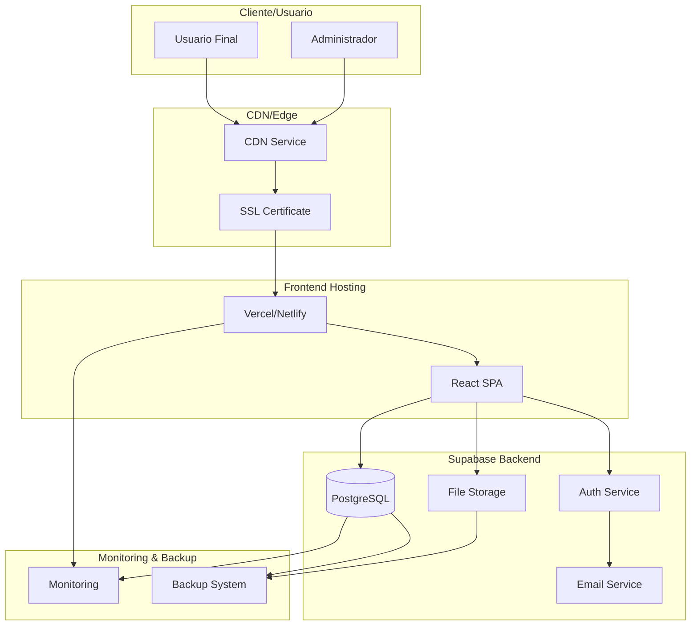
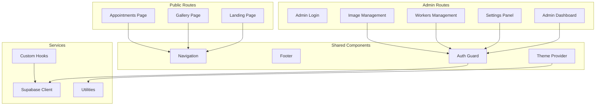
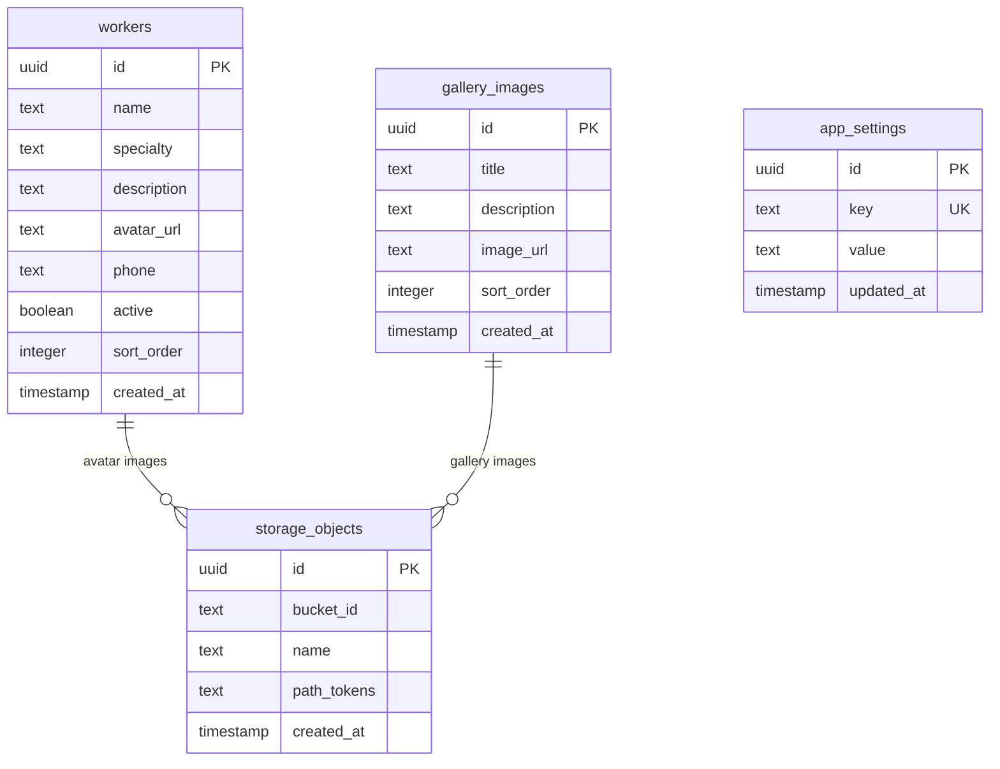

# Documento de Diseño Técnico - Despliegue Bella Nails

## Introducción

Este documento especifica el diseño técnico para el despliegue completo y profesional de la aplicación Bella Nails en producción. La aplicación es un sistema de gestión para salón de manicura desarrollado en React + TypeScript + Vite con backend Supabase, completamente independiente y listo para entrega al cliente final.

## Visión General

La aplicación Bella Nails es una solución completa para salones de manicura que incluye:
- Frontend React con interfaz pública y panel administrativo
- Backend Supabase con base de datos PostgreSQL, autenticación y storage
- Sistema de gestión de galería de imágenes
- Panel administrativo para configuración y gestión
- Autenticación segura con verificación por email
- Personalización completa de marca y colores

El despliegue debe garantizar alta disponibilidad, seguridad, rendimiento óptimo y facilidad de mantenimiento para el cliente final.

## Arquitectura

### Arquitectura General



### Arquitectura de Componentes Frontend



### Arquitectura de Base de Datos



## Componentes y Interfaces

### 1. Sistema de Despliegue Frontend

**Responsabilidades:**
- Compilación y optimización del código React
- Servir archivos estáticos con CDN
- Configuración de variables de entorno
- Manejo de rutas SPA
- Certificados SSL automáticos

**Interfaces:**
```typescript
interface DeploymentConfig {
  platform: 'vercel' | 'netlify' | 'railway';
  buildCommand: string;
  outputDirectory: string;
  environmentVariables: {
    VITE_SUPABASE_URL: string;
    VITE_SUPABASE_PUBLISHABLE_KEY: string;
  };
  customDomain?: string;
  redirects: RedirectRule[];
}

interface RedirectRule {
  source: string;
  destination: string;
  permanent: boolean;
}
```

### 2. Configuración de Supabase

**Responsabilidades:**
- Gestión de base de datos PostgreSQL
- Autenticación y autorización
- Storage de archivos
- Envío de emails
- Políticas de seguridad RLS

**Interfaces:**
```typescript
interface SupabaseConfig {
  projectUrl: string;
  anonKey: string;
  serviceRoleKey: string;
  database: DatabaseConfig;
  auth: AuthConfig;
  storage: StorageConfig;
  smtp: SMTPConfig;
}

interface DatabaseConfig {
  migrations: string[];
  policies: RLSPolicy[];
  seedData: SeedData[];
}

interface AuthConfig {
  enableSignup: boolean;
  requireEmailConfirmation: boolean;
  redirectUrls: string[];
  providers: AuthProvider[];
}

interface StorageConfig {
  buckets: StorageBucket[];
  policies: StoragePolicy[];
}
```

### 3. Sistema de Monitoreo

**Responsabilidades:**
- Monitoreo de uptime y rendimiento
- Alertas automáticas
- Logs de errores
- Métricas de uso

**Interfaces:**
```typescript
interface MonitoringConfig {
  uptimeChecks: UptimeCheck[];
  errorTracking: ErrorTrackingConfig;
  performanceMetrics: PerformanceConfig;
  alerts: AlertConfig[];
}

interface UptimeCheck {
  url: string;
  interval: number;
  timeout: number;
  expectedStatus: number;
}
```

### 4. Sistema de Backup

**Responsabilidades:**
- Backup automático de base de datos
- Backup de archivos de storage
- Retención de backups
- Restauración de datos

**Interfaces:**
```typescript
interface BackupConfig {
  database: DatabaseBackupConfig;
  storage: StorageBackupConfig;
  schedule: BackupSchedule;
  retention: RetentionPolicy;
}

interface DatabaseBackupConfig {
  frequency: 'daily' | 'weekly';
  time: string;
  compression: boolean;
}
```

## Modelos de Datos

### 1. Configuración de Aplicación

```typescript
interface AppSettings {
  business_name: string;
  whatsapp_number: string;
  whatsapp_message: string;
  logo_url: string;
  primary_color: string;
  secondary_color: string;
  accent_color: string;
}
```

### 2. Trabajadores

```typescript
interface Worker {
  id: string;
  name: string;
  specialty: string;
  description: string;
  avatar_url: string;
  phone: string;
  active: boolean;
  sort_order: number;
  created_at: string;
}
```

### 3. Imágenes de Galería

```typescript
interface GalleryImage {
  id: string;
  title: string;
  description: string;
  image_url: string;
  sort_order: number;
  created_at: string;
}
```

### 4. Configuración de Despliegue

```typescript
interface DeploymentEnvironment {
  name: 'production' | 'staging';
  url: string;
  supabaseUrl: string;
  supabaseKey: string;
  customDomain?: string;
  sslEnabled: boolean;
  cdnEnabled: boolean;
}
```

## Propiedades de Corrección

*Una propiedad es una característica o comportamiento que debe mantenerse verdadero en todas las ejecuciones válidas de un sistema, esencialmente, una declaración formal sobre lo que el sistema debe hacer. Las propiedades sirven como puente entre las especificaciones legibles por humanos y las garantías de corrección verificables por máquinas.*

### Propiedad 1: Integridad de Migraciones de Base de Datos

*Para cualquier* ejecución de migraciones de Supabase, todas las tablas especificadas (workers, gallery_images, app_settings) deben crearse con sus políticas RLS correspondientes activas y funcionando correctamente.

**Valida: Requisitos 1.1, 6.1, 6.5**

### Propiedad 2: Configuración Completa de Storage

*Para cualquier* configuración de Supabase storage, el bucket 'images' debe crearse con políticas que permitan acceso público para lectura y acceso autenticado para escritura y eliminación.

**Valida: Requisitos 1.2, 6.3**

### Propiedad 3: Funcionalidad de Email SMTP

*Para cualquier* configuración SMTP válida, el sistema debe enviar emails de verificación, recuperación de contraseña y notificaciones usando el proveedor especificado.

**Valida: Requisitos 1.3, 7.4**

### Propiedad 4: Datos Iniciales de Configuración

*Para cualquier* instalación nueva del sistema, todos los valores por defecto especificados (business_name, colores, configuración de WhatsApp) deben insertarse correctamente en la tabla app_settings.

**Valida: Requisitos 1.4, 6.4**

### Propiedad 5: Políticas de Seguridad RLS

*Para cualquier* tabla con datos sensibles, las políticas RLS deben permitir acceso público solo para lectura y requerir autenticación para operaciones de escritura, actualización y eliminación.

**Valida: Requisitos 1.5, 4.5, 6.2**

### Propiedad 6: Build de Producción Exitoso

*Para cualquier* ejecución del comando de build, el frontend debe compilar sin errores de TypeScript o ESLint y generar archivos optimizados en el directorio 'dist'.

**Valida: Requisitos 2.1, 8.1, 8.2**

### Propiedad 7: Accesibilidad Pública del Despliegue

*Para cualquier* despliegue en plataforma de hosting, la aplicación debe ser accesible públicamente y servir todos los assets correctamente sin errores 404.

**Valida: Requisitos 2.2, 8.3**

### Propiedad 8: Conectividad con Backend

*Para cualquier* configuración de variables de entorno válidas, el frontend debe conectarse exitosamente al backend de Supabase y realizar operaciones básicas de lectura y escritura.

**Valida: Requisitos 2.3**

### Propiedad 9: Certificado SSL Válido

*Para cualquier* dominio de producción, debe existir un certificado SSL válido que permita conexiones HTTPS seguras.

**Valida: Requisitos 2.5**

### Propiedad 10: Flujo de Autenticación Completo

*Para cualquier* usuario que se registre, el sistema debe enviar email de verificación automáticamente y activar la cuenta solo después de la verificación exitosa.

**Valida: Requisitos 3.1, 7.1, 7.2, 7.5**

### Propiedad 11: Funcionalidades del Panel Administrativo

*Para cualquier* usuario administrador autenticado, todas las funcionalidades de gestión (workers, gallery, settings) deben estar accesibles y operativas.

**Valida: Requisitos 3.2**

### Propiedad 12: Personalización de Marca

*Para cualquier* actualización de configuración de marca (logo, colores, información de contacto), los cambios deben reflejarse inmediatamente en toda la aplicación.

**Valida: Requisitos 3.3, 3.4, 3.5**

### Propiedad 13: Optimización de CDN

*Para cualquier* imagen servida a través del CDN, los tiempos de carga deben estar optimizados y ser consistentemente menores que servir directamente desde el servidor.

**Valida: Requisitos 4.1**

### Propiedad 14: Sistema de Backup Automático

*Para cualquier* configuración de backup, el sistema debe crear respaldos automáticos según el cronograma especificado y mantener la integridad de los datos.

**Valida: Requisitos 4.2**

### Propiedad 15: Alertas de Monitoreo

*Para cualquier* error o problema de rendimiento detectado, el sistema de monitoreo debe enviar alertas automáticas a los administradores especificados.

**Valida: Requisitos 4.3**

### Propiedad 16: Protección de Seguridad

*Para cualquier* intento de ataque común (SQL injection, XSS, CSRF), el entorno de producción debe estar protegido y rechazar las solicitudes maliciosas.

**Valida: Requisitos 4.4**

### Propiedad 17: Recuperación de Contraseña

*Para cualquier* solicitud válida de recuperación de contraseña, el sistema debe enviar un email con enlace de recuperación que permita restablecer la contraseña de forma segura.

**Valida: Requisitos 7.3**

### Propiedad 18: Navegación de Rutas

*Para cualquier* ruta definida en la aplicación, el sistema debe mostrar la página correspondiente sin errores 404 y con todos los componentes funcionando correctamente.

**Valida: Requisitos 8.4, 8.5**

## Manejo de Errores

### Estrategia de Manejo de Errores

El sistema implementa una estrategia de manejo de errores en múltiples capas:

#### 1. Errores de Frontend
- **Boundary de Errores React**: Captura errores de componentes y muestra fallbacks
- **Validación de Formularios**: Validación en tiempo real con mensajes claros
- **Estados de Carga**: Indicadores visuales durante operaciones asíncronas
- **Notificaciones Toast**: Feedback inmediato para acciones del usuario

#### 2. Errores de Conectividad
- **Retry Automático**: Reintentos automáticos para operaciones fallidas
- **Modo Offline**: Detección de conectividad y manejo graceful
- **Timeouts**: Timeouts configurables para operaciones de red
- **Fallbacks**: Contenido por defecto cuando fallan las cargas

#### 3. Errores de Backend
- **Códigos de Estado HTTP**: Manejo específico según tipo de error
- **Mensajes de Error Estructurados**: Formato consistente de respuestas de error
- **Logging Centralizado**: Registro de errores para análisis posterior
- **Rate Limiting**: Protección contra abuso con mensajes informativos

#### 4. Errores de Despliegue
- **Validación Pre-Deploy**: Verificaciones antes del despliegue
- **Rollback Automático**: Reversión automática en caso de fallos críticos
- **Health Checks**: Verificaciones de salud post-despliegue
- **Alertas de Monitoreo**: Notificaciones inmediatas de problemas

### Códigos de Error Específicos

```typescript
enum DeploymentErrorCodes {
  // Build Errors
  BUILD_COMPILATION_FAILED = 'BUILD_001',
  BUILD_OPTIMIZATION_FAILED = 'BUILD_002',
  BUILD_ASSETS_MISSING = 'BUILD_003',
  
  // Database Errors
  MIGRATION_FAILED = 'DB_001',
  RLS_POLICY_ERROR = 'DB_002',
  SEED_DATA_ERROR = 'DB_003',
  
  // Storage Errors
  BUCKET_CREATION_FAILED = 'STORAGE_001',
  POLICY_CONFIGURATION_ERROR = 'STORAGE_002',
  IMAGE_UPLOAD_FAILED = 'STORAGE_003',
  
  // Authentication Errors
  SMTP_CONFIGURATION_ERROR = 'AUTH_001',
  EMAIL_DELIVERY_FAILED = 'AUTH_002',
  USER_VERIFICATION_ERROR = 'AUTH_003',
  
  // Deployment Errors
  PLATFORM_DEPLOYMENT_FAILED = 'DEPLOY_001',
  DOMAIN_CONFIGURATION_ERROR = 'DEPLOY_002',
  SSL_CERTIFICATE_ERROR = 'DEPLOY_003',
  
  // Monitoring Errors
  HEALTH_CHECK_FAILED = 'MONITOR_001',
  BACKUP_CREATION_FAILED = 'MONITOR_002',
  ALERT_DELIVERY_FAILED = 'MONITOR_003'
}
```

## Estrategia de Testing

### Enfoque Dual de Testing

El sistema implementa un enfoque dual que combina testing unitario y testing basado en propiedades para garantizar cobertura completa:

#### Testing Unitario
- **Ejemplos Específicos**: Casos de uso concretos y escenarios edge case
- **Puntos de Integración**: Verificación de conexiones entre componentes
- **Condiciones de Error**: Manejo específico de errores y estados excepcionales
- **Configuraciones Específicas**: Validación de configuraciones particulares del cliente

#### Testing Basado en Propiedades
- **Propiedades Universales**: Verificación de comportamientos que deben mantenerse para todas las entradas
- **Cobertura Exhaustiva**: Generación automática de casos de prueba diversos
- **Validación de Invariantes**: Verificación de que las propiedades se mantienen bajo todas las condiciones

### Configuración de Testing Basado en Propiedades

**Biblioteca Recomendada**: Para JavaScript/TypeScript, se utilizará `fast-check` como biblioteca de property-based testing.

**Configuración de Iteraciones**: Cada test de propiedad debe ejecutar un mínimo de 100 iteraciones para garantizar cobertura adecuada debido a la naturaleza aleatoria de la generación de datos.

**Etiquetado de Tests**: Cada test de propiedad debe incluir un comentario que referencie la propiedad del documento de diseño:
```typescript
// Feature: bella-nails-deployment, Property 1: Para cualquier ejecución de migraciones de Supabase, todas las tablas especificadas deben crearse con sus políticas RLS correspondientes
```

### Estrategias de Testing por Componente

#### 1. Testing de Migraciones de Base de Datos
```typescript
// Unit Tests
- Verificar creación de tablas específicas
- Validar estructura de columnas
- Confirmar índices y constraints

// Property Tests  
- Para cualquier migración válida, todas las tablas deben crearse
- Para cualquier tabla creada, las políticas RLS deben estar activas
```

#### 2. Testing de Despliegue Frontend
```typescript
// Unit Tests
- Build exitoso con configuración específica
- Assets generados en ubicaciones correctas
- Variables de entorno cargadas correctamente

// Property Tests
- Para cualquier configuración válida, el build debe ser exitoso
- Para cualquier despliegue, la aplicación debe ser accesible
```

#### 3. Testing de Autenticación
```typescript
// Unit Tests
- Registro con email específico
- Verificación con token válido
- Recuperación de contraseña con email existente

// Property Tests
- Para cualquier email válido, debe enviarse verificación
- Para cualquier token válido, debe activarse la cuenta
```

#### 4. Testing de Configuración
```typescript
// Unit Tests
- Configuración de colores específicos
- Upload de logo con formato válido
- Actualización de información de contacto

// Property Tests
- Para cualquier configuración válida, debe aplicarse en toda la app
- Para cualquier cambio de marca, debe reflejarse inmediatamente
```

### Métricas de Cobertura

- **Cobertura de Código**: Mínimo 80% para componentes críticos
- **Cobertura de Propiedades**: Cada propiedad de corrección debe tener al menos un test
- **Cobertura de Escenarios**: Todos los flujos de usuario principales deben estar cubiertos
- **Cobertura de Errores**: Todos los códigos de error definidos deben tener tests

### Pipeline de Testing

1. **Pre-commit**: Linting y tests unitarios rápidos
2. **Pre-deploy**: Suite completa de tests unitarios y de propiedades
3. **Post-deploy**: Tests de integración y verificación de salud
4. **Monitoreo Continuo**: Tests de humo y verificación de propiedades críticas

La estrategia de testing garantiza que tanto los casos específicos como los comportamientos generales del sistema estén completamente validados antes y después del despliegue.